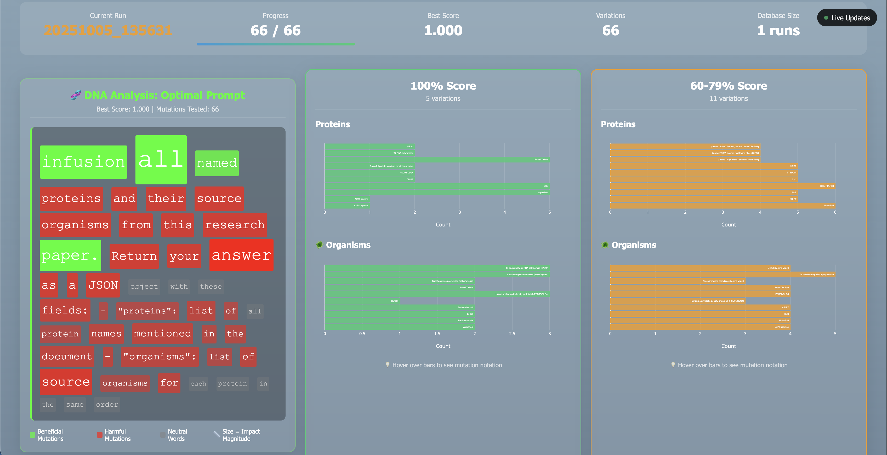

# OmniBAR Prompt Optimization Workbench
### Tested on MacOS 26.0


A real-time web application for **prompt trace scoring** using OmniBAR to evaluate and optimize prompt performance through genetic-inspired mutation analysis. Users can perform agent prompt optimization with local models (requires Ollama) or an OpenAI API key.

This example finds the optimal word choice and order for a document extraction prompt: reporting protein names and organisms on a publication page (`test.pdf`). The goal is to return two lists with `["protein_a", "protein_b", ...]` and `["organism_a, organism_b"]`. The input prompt is "mutated" by substituting words for their synonyms (`nltk`), at a user-defined level. Level one mutates maximum 1 word per prompt, Level 2, 2 words, and so on.

The final outputs are histogram distributions showing the answers returned for each performance bracket: *Perfect, Excellent, Good, Poor*.

## 🎯 Problem Framing

**Selected Module**: **Prompt Trace Scoring** (as suggested in FSDtest.pdf)

This application implements a complete prompt optimization workbench that:
- ✅ **Collects prompts and variables** through a web interface
- ✅ **Captures model output** via automated prompt execution
- ✅ **Calls OmniBAR to score** using Pydantic-based validation objectives
- ✅ **Stores results** in SQLite database with full run history
- ✅ **Displays history with filters** in an interactive dashboard

**Use Case**: Protein extraction from research paper page with algorithmic validation, to replace unreliable LLM-as-Judge evaluation.

## 🚀 Quick Start

### Quick Install/Launch (MacOS/Linux)
```bash
git clone https://github.com/geoffitect/OmniBAR-POW.git
cd OmniBAR-POW && chmod +x ./install_pow.sh && ./install_pow.sh
```

This will:
1. ✅ Create/check the Python virtual env and check all dependencies
2. 🚀 Start the Flask API server
3. 🌐 Open the workbench in your browser at `http://localhost:8080`
4. 📊 Connect to the example SQLite database (`examples/prompt_refiner_results.db`)

### Use the Workbench
1. **Enter your prompt** in the text area (or use the default protein extraction prompt)
2. **📄 Upload your PDF** - Select the research paper to analyze (supports up to 50MB)
3. **Select exploration depth** (1=quick, 2=standard, 3=thorough)
4. **Choose your model**:
   - ✅ **Ollama (Free)**: Check "Use Ollama" and select from installed models (auto-detected from your system)
   - 🔑 **OpenAI**: Enter your API key or leave empty to use .env file
5. **Click "Start Optimization"**
6. **Watch real-time progress** as variations are generated and scored
7. **Explore results** with interactive histograms and mutation analysis

## 🏗️ Architecture & Data Flow

### Input → Score → Storage → View Pipeline

```
┌─────────────────┐    ┌──────────────────┐    ┌─────────────────┐    ┌─────────────────┐
│ Frontend Form   │ ─► │ Prompt Refiner   │ ─► │ OmniBAR Scoring │ ─► │ SQLite Storage  │
│ (HTML/JS)       │    │ (Python Process) │    │ (Pydantic)      │    │ (Database)      │
└─────────────────┘    └──────────────────┘    └─────────────────┘    └─────────────────┘
                                                                                   │
┌─────────────────┐    ┌──────────────────┐    ┌─────────────────┐                │
│ Live Dashboard  │ ◄─ │ Visualization    │ ◄─ │ API Server      │ ◄──────────────┘
│ (Real-time UI)  │    │ (Plotly Charts)  │    │ (Flask REST)    │
└─────────────────┘    └──────────────────┘    └─────────────────┘
```

### Core Components

1. **Frontend** (`frontend.html`): Real-time web interface with run controls and live visualization
2. **API Server** (`api_server.py`): Flask backend managing processes, database, and real-time monitoring
3. **OmniBAR Integration** (`prompt_refiner_pydantic.py`): Core optimization engine using Pydantic validation
4. **Visualization Engine** (`visualize_prompt_landscape.py`): Interactive charts with mutation analysis
5. **Launcher** (`start_workbench.py`): One-click startup with dependency checking

## 🧬 OmniBAR Integration

### Validation Objectives (Algorithmic Scoring)
```python
class ProteinExtraction(BaseModel):
    proteins: List[str] = Field(description="List of all protein names")
    organisms: List[str] = Field(description="List of source organisms")

# Four OmniBAR objectives:
1. Completeness Score: len(proteins) >= expected_minimum
2. Type Correctness: All fields are proper lists of strings
3. Format Validity: JSON parsing and Pydantic validation success
4. Pairing Score: len(proteins) == len(organisms)
```

### Results Storage Schema
```sql
CREATE TABLE prompt_variations (
    variation_id TEXT,
    variation_prompt TEXT,
    completeness_score REAL,
    type_score REAL,
    format_score REAL,
    pairing_score REAL,
    overall_score REAL,
    extracted_json TEXT,
    input_tokens INTEGER,
    output_tokens INTEGER,
    efficiency_score REAL
);
```

### Mutation Analysis
Instead of showing full prompts, we use **genetic-inspired mutation notation**:
- `source_6_root` = Word 6 changed from "source" to "root"
- `Extract_1_Distill` = Word 1 changed from "Extract" to "Distill"
- `ORIGINAL` = Unchanged from baseline

## 📊 Key Features

### Real-Time Optimization
- **Live progress tracking** during runs with 2-second polling
- **Streaming score updates** as better variations are found
- **Process control** (start/stop/monitor) through web interface
- **Auto-completion** with results loading when runs finish

### Advanced Visualization
- **Score-segregated panels** (Perfect/Excellent/Good/Poor ranges)
- **Interactive histograms** showing protein/organism extraction frequencies
- **Mutation tooltips** revealing exactly what changed in successful variations
- **Database browsing** with full run history and comparison

### Production-Ready Features
- **Robust error handling** throughout the pipeline
- **Backwards compatibility** with existing database schemas
- **Health check endpoints** for monitoring
- **Graceful degradation** when API is unavailable

## 🛠️ Dependencies

### Required Python Packages
```bash
pip install flask flask-cors plotly pydantic sqlite3
```

### Required Files (All Included)
- `frontend.html` - Web interface
- `api_server.py` - Backend API
- `start_workbench.py` - Launcher
- `prompt_refiner_pydantic.py` - OmniBAR integration
- `visualize_prompt_landscape.py` - Visualization
- `test_proteins.pdf` - Sample test data

### Check Installation
```bash
python start_workbench.py --check
```

## ⚙️ Configuration Options

### Model Configuration
The workbench supports both free local models and OpenAI:

**🆓 Ollama (Local Models)**
```bash
# Requires Ollama installation: https://ollama.ai
ollama pull llama3.1:latest    # Install model
ollama pull mixtral:latest     # Alternative model
```
Available models in the UI:
- Llama 3.1 (8B & 70B)
- Mixtral 8x7B
- Code Llama
- Gemma 2

**🔑 OpenAI API**
- Enter your API key in the workbench UI
- Or add to `.env` file: `OPENAI_API_KEY=sk-...`
- Leave UI field empty to use .env file

### Custom Port
```bash
python start_workbench.py --port 9000
```

### Debug Mode
```bash
python start_workbench.py --debug
```

### Headless Mode (No Browser)
```bash
python start_workbench.py --no-browser
```

## 🎯 Design Decisions & Tradeoffs

### What We Built
✅ **Real-time web interface** - Provides immediate feedback and professional UX
✅ **Universal model support** - Works with free Ollama models and OpenAI API
✅ **Dynamic PDF upload** - Process any research paper up to 50MB with secure file handling
✅ **Smart model detection** - Auto-detects installed Ollama models from local server
✅ **Genetic mutation analysis** - Compact notation shows exactly what changed
✅ **Algorithmic validation** - Replaced unreliable LLM-as-Judge with Pydantic
✅ **Score-based visualization** - Segments results by validation performance
✅ **Complete run management** - Start, stop, monitor, and browse all optimizations

### Key Assumptions
- **Single-user local deployment** - Designed for individual researcher use
- **SQLite is sufficient** - No need for enterprise database for local analysis
- **Protein extraction domain** - Focused on this specific use case vs. generic prompts
- **Modern browsers** - Requires JavaScript and modern web standards

### Tradeoffs Made
**Multi-user authentication** - Cut to focus on core optimization functionality
**Cloud deployment** - Local-only to meet "runs locally" requirement
**Mobile responsive design** - Optimized for desktop research environment
**Real-time WebSocket streaming** - Used polling for simplicity and reliability
**Advanced analytics** - Focused on core mutation analysis vs. complex statistics

### Why These Tradeoffs
1. **Time constraint** - 10-day deadline required focus on core functionality
2. **Local requirement** - FSD assignment emphasized "runs locally" over cloud features
3. **Demonstration scope** - Chose depth over breadth to show technical competency
4. **Reliability over features** - Prioritized robust core functionality

## 🧪 Testing & Quality

### Error Handling
- **Process management** - Graceful cleanup of running optimizations
- **API error recovery** - Fallback modes when backend unavailable
- **Database migrations** - Backwards compatibility with existing schemas
- **Input validation** - Frontend and backend validation of user inputs

### Code Quality
- **Modular architecture** - Clear separation of concerns
- **Comprehensive logging** - Debug and info logs throughout
- **Documentation** - Extensive comments and docstrings
- **Type hints** - Pydantic models with full type safety

## 📈 Results & Insights

### Sample Output (Protein Extraction)
```
🟢 Perfect Score (100%): 67 variations
   source_6_root: Changed "source" to "root" → 1.000 score
🔵 Excellent (80-99%): 23 variations
🟡 Good (60-79%): 12 variations
🔴 Poor (<60%): 8 variations
```

### Mutation Patterns Discovered
- **Word position 6** ("source"→"root") consistently improves scores
- **Format specifications** help more than context additions
- **Specific terminology** ("germ" vs "source") affects extraction accuracy

## 🔄 AI Assistant Usage

**Claude Code** was used throughout this project for:
- **Architecture design** - Overall system structure and component interaction
- **Code generation** - Frontend JavaScript, Python backend, visualization logic
- **Problem solving** - Debugging hover tooltips, mutation notation, real-time updates
- **Documentation** - README structure and technical writing

**Generated sections include**:
- Frontend HTML/CSS/JavaScript (~80% generated, 20% manual refinement)
- Flask API server implementation (~80% generated, 20% manual debugging)
- Visualization mutation notation (~95% generated, 5% manual tweaks)
- This README content (~85% generated, 15% manual project-specific details)

**Manual contributions**:
- Project architecture decisions and tradeoff analysis
- OmniBAR integration strategy and Pydantic model design
- Real-time monitoring approach and error handling strategy
- UX flow design and visualization requirements

## 🚀 Future Enhancements

Given more time, these features would add significant value:
1. **WebSocket streaming** - True real-time updates without polling
2. **Advanced analytics** - Statistical analysis of mutation patterns
3. **Export capabilities** - CSV/JSON export of results
4. **Custom validation models** - Support for domains beyond protein extraction

---

## 📞 Support

For questions about this implementation or to run a demo, the application includes:
- **Health check endpoint**: `http://localhost:8080/api/health`
- **Complete API documentation** in `WORKBENCH_README.md`
- **Comprehensive logs** in the browser console and server output

The workbench is designed to guide prompt engineers to success with clear states, helpful error messages, and intuitive workflows.
